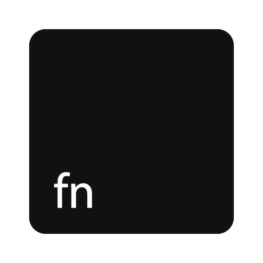

<h1 align="center">
   Function Toggler 
</h1>

<p align="center">
   Quickly<sup>*</sup> toggle the <strong>"Use all F1, F2, etc. keys as standard function keys"</strong> option in macOS System Preferences
</p>

> <sup>\*</sup> Through the shortcut


## Install

### Via [Homebrew Cask](//brew.sh) (Recommended)

```ps1
brew install --cask --no-quarantine artginzburg/tap/functiontoggler
```

> Check out [the cask][cask] if you're interested.

### Direct Download

**[Latest Release ](//github.com/artginzburg/FunctionToggler/releases/latest/download/FunctionToggler.zip)**

### Using Source Code

1. Install [`platypus`](https://github.com/sveinbjornt/Platypus) CLI.

> I use it instead of `osacompile -o MyScript.app MyScript.scpt` because it offers better interface and for some reason compiles to less size.

```ps1
brew install platypus
```

2. Clone, set current directory and run the build command.

> also allows to `make uninstall`

```ps1
git clone https://github.com/artginzburg/FunctionToggler
cd FunctionToggler
make
make install
```

---

<details>
   <summary>Function Toggler needs Accessibility Control</summary>

1.  Open the app once (for it to appear in Accessibility tab)
2.  Go to `System Preferences` > `Security & Privacy` > `Privacy` > `Accessibility`
3.  `Click the lock to make changes` and tick `Function Toggler` under `Allow the apps below to control your computer`.


</details>

## Usage

Simply run the app.
I like to do it from Spotlight:

1. Press <kbd>⌘</kbd> + <kbd>space</kbd> (or similar) to open Spotlight.
2. Start typing `fun` or `ft`, continue until `Function Toggler` appear in the Top Hit section.
3. Hit <kbd>Enter</kbd>.

## Enable the Keyboard shortcut

Go to `System Preferences` > `Keyboard` > `Shortcuts` > `Services` > `General` (at the end of the list) and assign a new shortcut to `Function Toggler` service


> The workflow (service) just runs the app, so it won't work without it.

### How to release

1. Run `make build` and `make release`.
2. Upload the generated archive — `dist/FunctionToggler.zip` — to GitHub Releases.
3. Update [the cask][cask] with the new version number and the checksum that lies in your clipboard after running `make release`.

[cask]: https://github.com/artginzburg/homebrew-tap/blob/main/Casks/functiontoggler.rb
