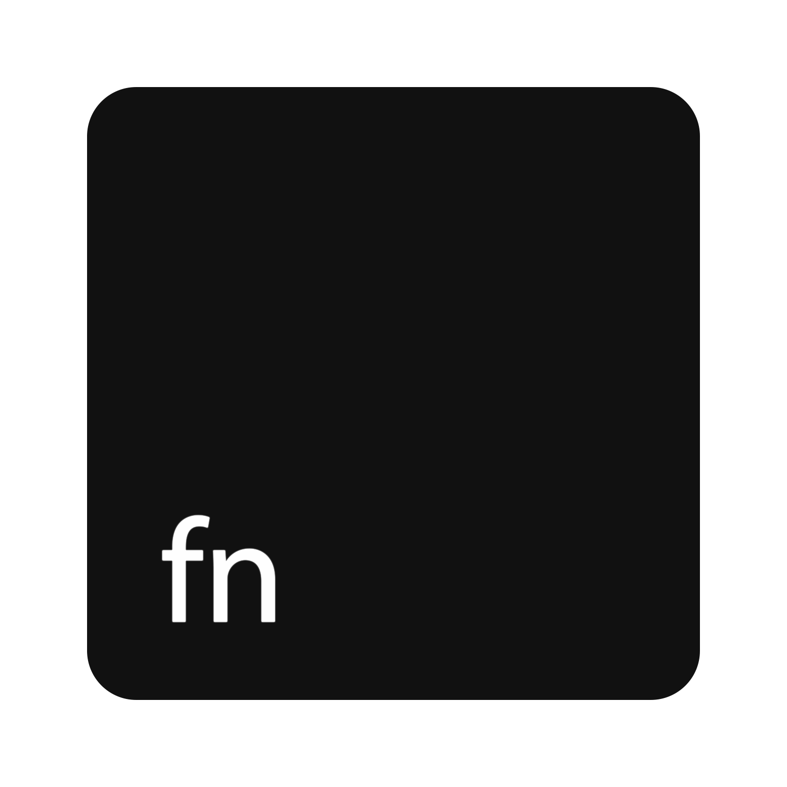
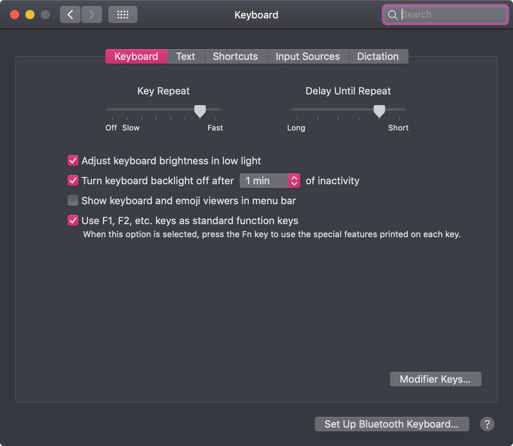
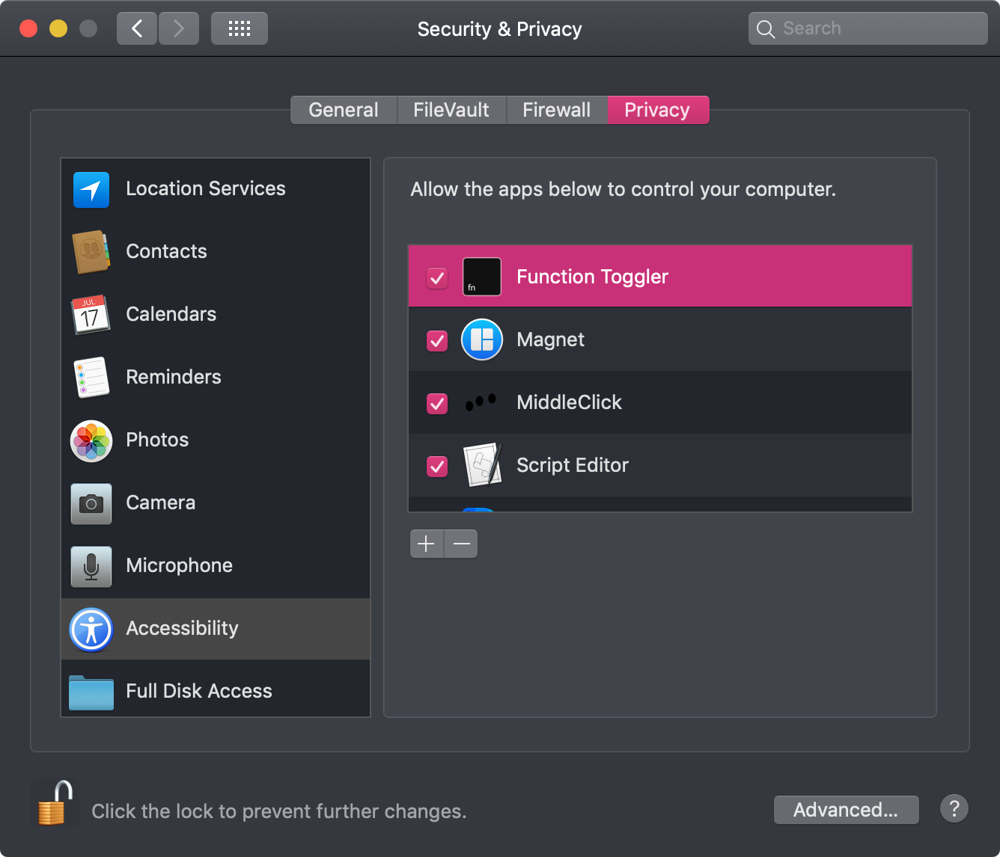
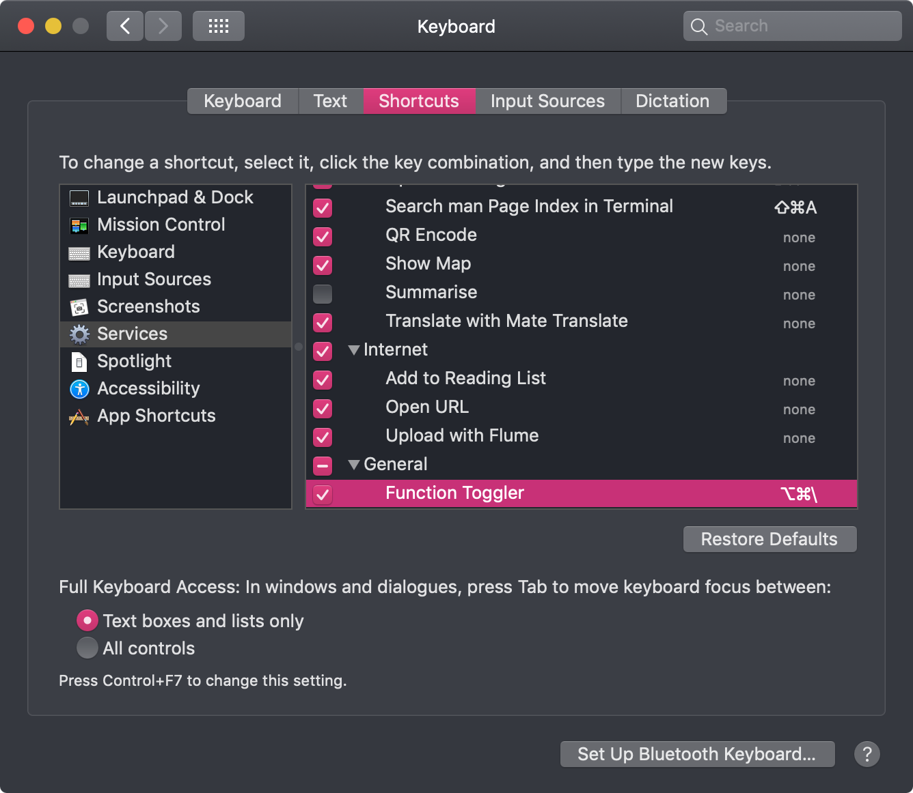

<h1 align="center">
   Function Toggler 
</h1>

<p align="center">
   Quickly toggle the <strong>"Use all F1, F2, etc. keys as standard function keys"</strong> option in macOS System Preferences
</p>

> By “Quickly” I mean “Through the shortcut”



<h2 align="center">
   <a href="//github.com/DaFuqtor/FunctionToggler/releases/latest/download/FunctionToggler.zip">
      Download latest release
   </a>
   <a href="//github.com/DaFuqtor/FunctionToggler/releases/latest">
      
   </a>
</h2>

## Install

### Using [Homebrew](//brew.sh)

```powershell
brew cask install dafuqtor/tap/functiontoggler
```

### Via Source Code

> also allows to `make uninstall`

```powershell
git clone https://github.com/DaFuqtor/FunctionToggler
cd FunctionToggler
make
```

---

Function Toggler needs Accessibility Control, so

1. Open the app once (for it to appear in Accessibility tab)
2. Go to `System Preferences` > `Security & Privacy` > `Privacy` > `Accessibility`
3. `Click the lock to make changes` and tick `Function Toggler` under `Allow the apps below to control your computer`.



## Usage

Simply run the app.
I like to do it from Spotlight:

1. Press <kbd>⌘</kbd> + <kbd>space</kbd> (or similar) to open Spotlight.
2. Start typing `fun`, continue until `Function Toggler` appear in the Top Hit section.
3. Hit <kbd>Enter</kbd>.

## Enable the Keyboard shortcut

1. Go to `System Preferences` > `Keyboard` > `Shortcuts` > `Services` > `General` 
   (at the end of the list) and assign a new shortcut to `Function Toggler` service


